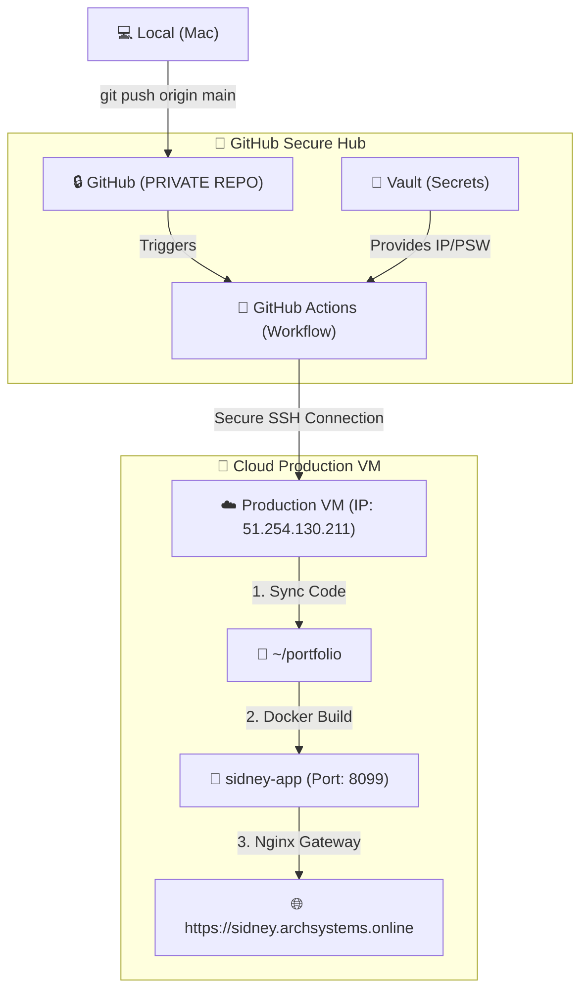

# Sidney's Automated Architecture: The Infrastructure Blueprint

This document explains the "under-the-hood" connection between your **Mac**, your **GitHub account**, and your **Remote Production VM**.

## 1. The Architectural Flow (Visualized)

---

## 2. Summary of Component Connections

| Component | Responsibility | Privacy Status |
| :--- | :--- | :--- |
| **Local (Mac)** | Where you edit your HTML, CSS, and Content. | **Local Only** |
| **GitHub Repo** | Stores your file history and acts as the "Source of Truth." | **PRIVATE** (Only YOU see it) |
| **GitHub Secrets** | Stores your VM's Password and IP address. | **ENCRYPTED** (Invisible to everyone) |
| **GitHub Actions** | The "Robot" that logs into your VM to perform the update. | **PRIVATE** |
| **Docker Engine** | Packages your resume so it runs the same on any server. | **REMOTE VM** |
| **Nginx (VM)** | The "Security Guard" that routes your domain to the Docker container. | **REMOTE VM** |

---

## 3. The "Secret" to Security (ZERO-LEAK)
The most important part of this architecture is that **none of your sensitive data** (IP, Password, SSH keys) is stored in the repository files.

- Your **`index.html`** is public on the web.
- Your **Deployment logic** is private on GitHub.
- Your **Infrastructure credentials** are locked in the GitHub Vault (Secrets).

### **How to Trigger an Update:**
Simply run these commands in your `SCLOSBANES` folder:
1. `git add .`
2. `git commit -m "Update Experience"`
3. `git push origin main`

**System Status: Architect-Verified | 100% Secure | Live at Sidney.Archsystems.Online**
